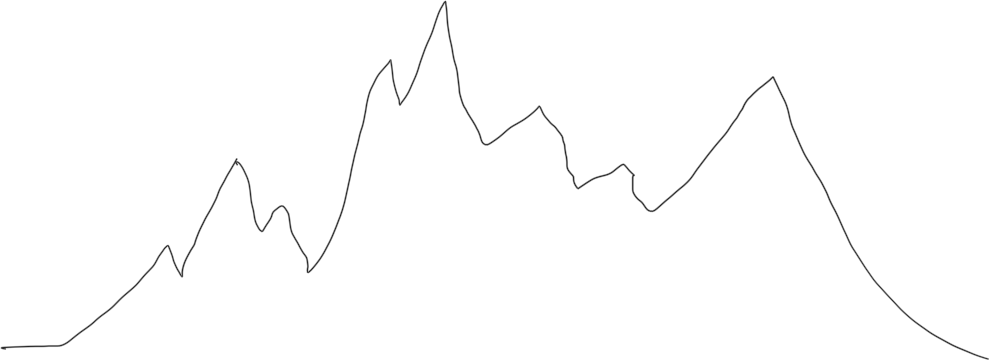

**Problem Statement**: \***\*IMPORTANT\*\*** You are NOT allowed to use built in language functions which trivialize the task of computing exponents. Any submissions which use this and avoid the task at hand will be given a 0.

Peak detection in signals has many applications, from scanning for irregularities in the heart to identifying outliers in data. A robust algorithm to for peak detection is very useful. Define the \*left peak function\*, denoted $p_l$(s), s as the total number of times that a peak is taller than one of its left neighboring peaks. The right peak function, $p_r$(s), is defined analogously. The signal s in image below has 8 peaks, $p_l$ = 19, the contribution of each peak is listed below.

Design and analyze a divide and conquer algorithm that computes the left function of a signal s with n peaks. The input A[1, . . . , n] consists of the heights of each peak in left to right order; assume all peaks have unique heights. Your solution should have a running time of Θ(n log n).

**Input Format**: First line is n, followed by n unique integers separated by spaces.
5
3 4 1 8 2 .

**Constraints**: The integers will satisfy 2 ≤ n ≤ $2^{64}$ and 1 ≤ Peak height ≤ $2^{64}$

**Output Format**: An integer output of left peak function.
5

**Explanation**:There are 5 peaks, p1=3, p2=4, p3=1, p4=8, p5=2.
Left peak function :
Number of peaks to the left of p1, shorter than p1 = 0
Number of peaks to the left of p2, shorter than p2 = 1
Number of peaks to the left of p3, shorter than p3 = 0
Number of peaks to the left of p4, shorter than p4 = 3
Number of peaks to the left of p5, shorter than p5 = 1
Output of left peak function = 0+1+0+3+1 = 5
